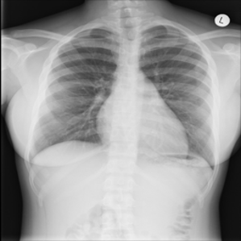

# Lung X-Ray Classification

### Project Summary:

This project creates a machine learning model that classifies the lung X-Ray images into 3 categories: COVID, Pneumonia, or a healthy lung, using Tensorflow and Keras..

---

### Dataset Description:

We are combining the datasets from multiple locations. You can find the individual datasets here:

1) Kermany, Daniel; Zhang, Kang; Goldbaum, Michael (2018), "Labeled Optical Coherence Tomography (OCT) and Chest X-Ray Images for Classification", Mendeley Data, V2, doi: 10.17632/rscbjbr9sj.2
2) COVID19_Pneumonia_Normal_Chest_Xray_PA_Dataset
3) - M.E.H. Chowdhury, T. Rahman, A. Khandakar, R. Mazhar, M.A. Kadir, Z.B. Mahbub, K.R. Islam, M.S. Khan, A. Iqbal, N. Al-Emadi, M.B.I. Reaz, M. T. Islam, "Can AI help in screening Viral and COVID-19 pneumonia?" IEEE Access, Vol. 8, 2020, pp. 132665 - 132676. Paper link
   - Rahman, T., Khandakar, A., Qiblawey, Y., Tahir, A., Kiranyaz, S., Kashem, S.B.A., Islam, M.T., Maadeed, S.A., Zughaier, S.M., Khan, M.S. and Chowdhury, M.E., 2020. Exploring the Effect of Image Enhancement Techniques on COVID-19 Detection using Chest X-ray Images. Paper Link

We have combined and prepared the dataset already. You can download it from the following dropbox link: `https://www.dropbox.com/s/73s9n7nugqrv1h7/Dataset.zip?dl=1`

Dataset contains 3 folders, namely:
- `Covid`: This folder contains lung x-ray images with covid-19 disease

- `Pneumonia`: This folder contains lung x-ray images with pneumonia disease

- `Normal`: This folder contains normal functioning and healthy lung x-ray images

---

### Machine Learning Model Architecture:

This model is composed of a transfer learning:
- `MobileNetV3Small` with `imagenet` weights
- `Dense` layer with `relu` activation function
- `BatchNormalization`
- `Dropout` layer
- `Dense` layer with `softmax` activation function

---

### Data Augmentation:

For the training dataset, I applied the following data augmentation to avoid overfitting:

- `zca_epsilon` = `0.0`
- `horizontal_flip` = `True`

---

### Training Hyperparameters:

* Epochs: `30`
  
* Optimizer: `Adam`

* Learning Rate: `0.001`

* Batch size: `64`

---

### Loss:

---

### Accuracy:

---

### Confusion Matrix without Normalization:

---

### Normalized Confusion Matrix:

